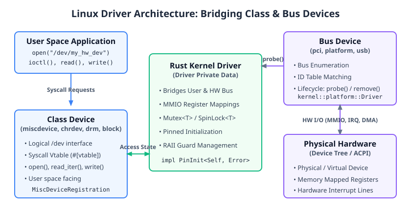

<!--
Copyright 2026 Google LLC
SPDX-License-Identifier: CC-BY-4.0
-->

# The Device Model

In Linux, a hardware driver that interacts with user space bridges two different sides of the kernel's Device Model:

<p align="center">
  
</p>

1. **Bus Devices (`platform`, `pci`, `usb`) — Hardware Facing:**
   - Bind to hardware discovered on a bus.
   - Drivers register an ID table (e.g., Device Tree compatible strings or PCI IDs).
   - The kernel calls the driver's `probe` method when matching hardware is found, and `remove` when it is unplugged.

2. **Class Devices (`miscdevice`, `chrdev`, `drm`, `block`) — User-Space Facing:**
   - Provide logical interfaces to user space, typically as character device nodes in `/dev` (or DRM display nodes in `/dev/dri/`).
   - Not enumerated by hardware buses; registered directly by a module or bus driver to expose file operations (`open`, `read`, `write`, `ioctl`).

```rust,ignore
// Comparison of trait entry points in Rust for Linux:

// Bus driver probing a physical/platform device:
impl kernel::platform::Driver for MyPlatformDriver {
    fn probe(_pdev: &mut kernel::platform::Device) -> Result<Self> { /* ... */ }
}

// Class device providing a /dev interface to user space:
impl kernel::miscdevice::MiscDevice for MyMiscDev {
    type Ptr = KBox<Self>;
    fn open(_file: &File, _misc: &MiscDeviceRegistration<Self>) -> Result<Self::Ptr> { /* ... */ }
}
```

<details>

- Discuss how a single kernel module might implement both: a platform driver (`probe`) that registers a `miscdevice` to expose its hardware to user space.
- Emphasize how `MiscDevice::Ptr` uses `ForeignOwnable` to store per-file session data in the file's `private_data` pointer.

</details>
