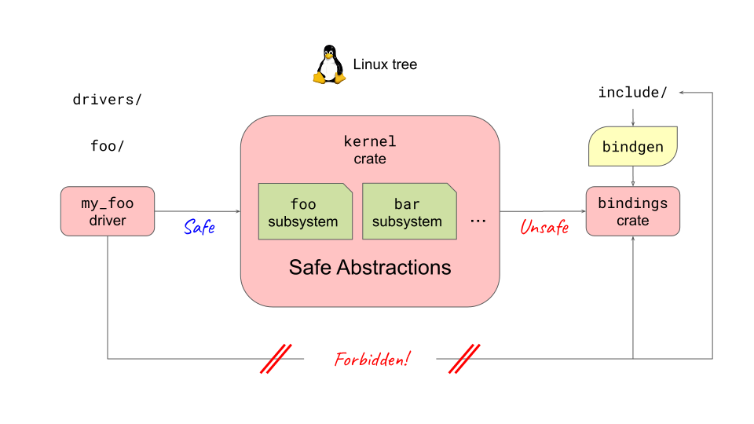

<!--
Copyright 2026 Google LLC
SPDX-License-Identifier: CC-BY-4.0
-->

# Overview of Rust in the Kernel

Rust is integrated into the Linux kernel as a second language for developing kernel modules, device drivers, and core subsystems.

The architecture separates unsafe C FFI boundaries from safe kernel module code:

  

## Architecture Layers

1. **Existing C Kernel APIs:**  
   The underlying Linux kernel is written in C. Subsystems expose C functions, structs, and macros.
2. **Unsafe Bindings & Helpers (`kernel::bindings`):**  
   `bindgen` generates low-level Rust FFI calls from C headers (`bindings_helper.h`), while `rust/helpers/` wraps static inline C functions and macros. Calling these bindings is `unsafe`.
3. **Safe Abstractions (`kernel` crate):**  
   The core `kernel` crate wraps the unsafe C FFI in idiomatic, safe Rust types (`ARef`, `KBox`, `Mutex`, `pin-init`, and driver traits). Every `unsafe` block inside the `kernel` crate must document its safety preconditions.
4. **Safe Rust Drivers:**  
   Kernel modules and drivers are written against the safe `kernel` crate abstractions, allowing developers to write robust kernel code without `unsafe` blocks.

- Walk students through `safeunsafe.svg`, highlighting the boundary between safe driver code and the unsafe C FFI wrapping layer.
- Emphasize that module authors primarily interact with the safe `kernel` crate, relying on the type system and borrow checker to enforce kernel invariants at compile time.

