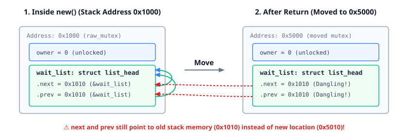

<!--
Copyright 2026 Google LLC
SPDX-License-Identifier: CC-BY-4.0
-->

# Mutex Initialization

The same self-referential problem occurs with kernel synchronization primitives.

In C, `mutex_init` does not return a mutex by value. Instead, it takes an **out-pointer** to initialize the mutex directly in its final memory location:

```c
// WRONG:
struct mutex mutex_init();

// CORRECT:
void mutex_init(struct mutex *lock);
```

## Why Mutexes Cannot Move

Under the hood, `struct mutex` contains an intrusive list head (`struct list_head wait_list`). When initialized, its `next` and `prev` pointers point to the `wait_list` field inside the mutex itself.

If we tried to construct a `Mutex` with a standard constructor in Rust:

```rust,ignore
// This DOES NOT WORK:
impl<T> Mutex<T> {
    pub fn new(value: T) -> Self {
        let mut raw_mutex: bindings::mutex = ...;

        // Initializes internal list pointers to the stack address of `raw_mutex`:
        unsafe { bindings::mutex_init(&mut raw_mutex); }

        // Returning moves `raw_mutex`, leaving its internal pointers pointing to old stack memory!
        Mutex { raw_mutex, data: UnsafeCell::new(value) }
    }
}
```

Moving the struct into a heap allocation (`KBox`) or struct field invalidates those internal pointers and breaks kernel locking.

<p align="center">
  
</p>

<details>

- Highlight the signature: C constructors in the kernel almost always take an out-pointer `struct mutex *lock` rather than returning a value.
- Moving in memory after `mutex_init` is undefined behavior in C and crashes the kernel.
- This is the core motivation for `pin-init`: initializing structs directly into their destination memory.

</details>
