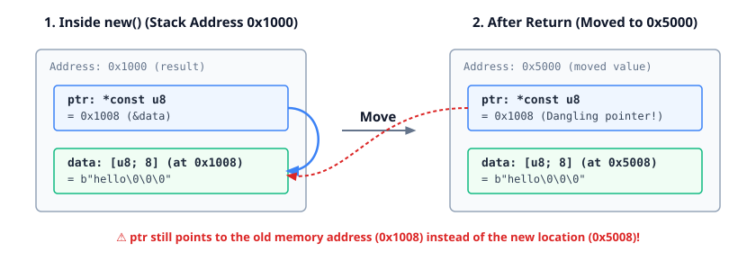

<!--
Copyright 2026 Google LLC
SPDX-License-Identifier: CC-BY-4.0
-->

# Pinned Initialization

This struct is difficult to translate to Rust:
```c
struct small_string {
    // Points at `data` for small strings, otherwise points at heap.
    char *ptr;
    char data[8];
};

/*
 * Copies `src` into `dst`, allocating memory if the string is large.
 */
int create_small_string(char *src, struct small_string *dst);
```

Example that **does not** work:

```rust,ignore
struct SmallString {
    ptr: *const u8,
    data: [u8; 8],
}

impl SmallString {
    fn new(s: &str) -> Self {
        let mut result = SmallString {
            ptr: ptr::null(),
            data: [0; 8],
        };

        if s.len() > 8 {
            result.ptr = /* allocate and copy memory */;
        } else {
            result.data.copy_from_slice(s.as_bytes());
            result.ptr = &raw const result.data;
        }

        // Returning `result` here changes the address of `data`.
        result
    }
}
```

<p align="center">
  
</p>

<details>

- Analogy: Talk about move constructors in C++, which do not exist in Rust. 

</details>
