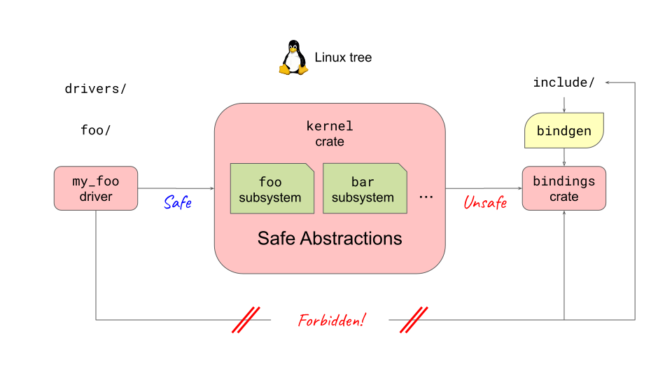

<!--
Copyright 2026 Google LLC
SPDX-License-Identifier: CC-BY-4.0
-->

# Unsafe Rust and Encapsulation

  

- Walk through the diagram from right to left:
  1. **Existing C Kernel APIs (`include/`):** The C headers and subsystems (`workqueue`, `cred`, `pci`, `drm`, etc.).
  2. **Unsafe Bindings (`kernel::bindings`):** Generated at build time by `bindgen` (plus C helpers in `rust/helpers/` for `static inline` functions and macros). Calling these raw FFI bindings is `unsafe`.
  3. **Safe Abstractions (`kernel` crate):** Wraps the raw C bindings in idiomatic, safe Rust APIs (`Arc`, `KBox`, `Mutex`, `workqueue`, driver traits) that enforce kernel invariants via types and lifetimes.
  4. **Safe Rust Drivers:** Written against the `kernel` crate. If a driver misuses an API (e.g., accesses data without locking or after unbind), it fails to compile. If safe driver code ever causes a Use-After-Free, that is a bug in the `kernel` crate abstraction, not in the driver.

