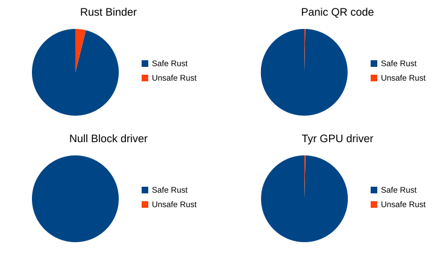

<!--
Copyright 2026 Google LLC
SPDX-License-Identifier: CC-BY-4.0
-->

# Unsafe Rust in Real-World Drivers

  

> _"The Sophisticate: 'The world isn't black and white. No one does pure good or pure bad. It's all gray. Therefore, no one is better than anyone else.'_
> _The Zetet: 'Knowing only gray, you conclude that all grays are the same shade. You mock the simplicity of the two-color view, yet you replace it with a one-color view...'"_
> — **The Fallacy of Gray**

- Walk through why there is any `unsafe` at all in these drivers:
  - **Rust Binder (`3.9%` unsafe):** Binder is split between Rust and C (`binderfs` is written in C), so it needs `unsafe` code to cross that custom C-to-Rust boundary.
  - **Tyr GPU Driver (`30` lines out of `7,362`):** `99.6%` safe Rust.
  - **Panic QR Code (`3` lines out of `915`):** Pure data manipulation called from C when the kernel panics. The 3 `unsafe` blocks are just the 3 `extern "C"` entrypoints exported to C.
  - **Null Block Driver (`0` lines):** `100%` safe Rust.
- **The Fallacy of Gray:** People sometimes argue *"Because the kernel uses `unsafe` inside abstractions, you lose Rust's guarantees."* Isolating `unsafe` into a small, shared abstraction layer gives massive practical improvements even though the kernel as a whole will always contain some `unsafe`.

